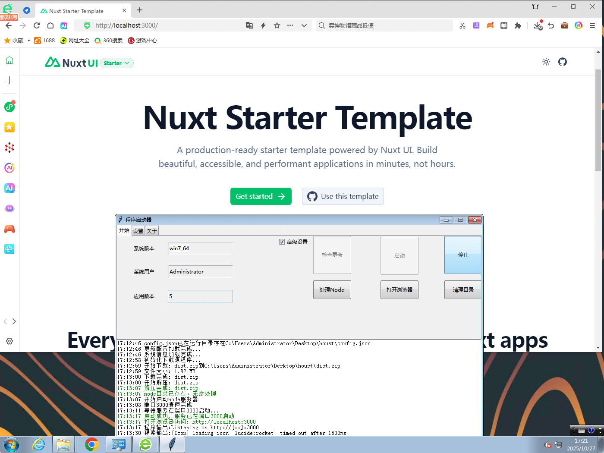
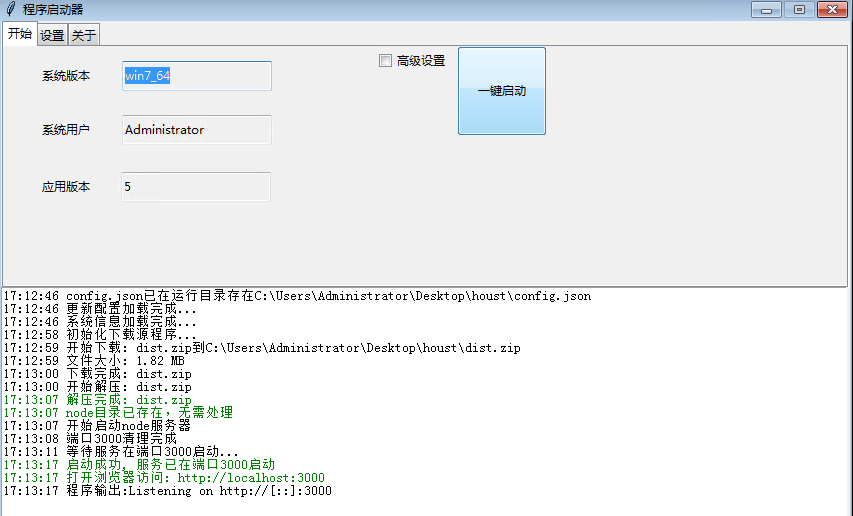
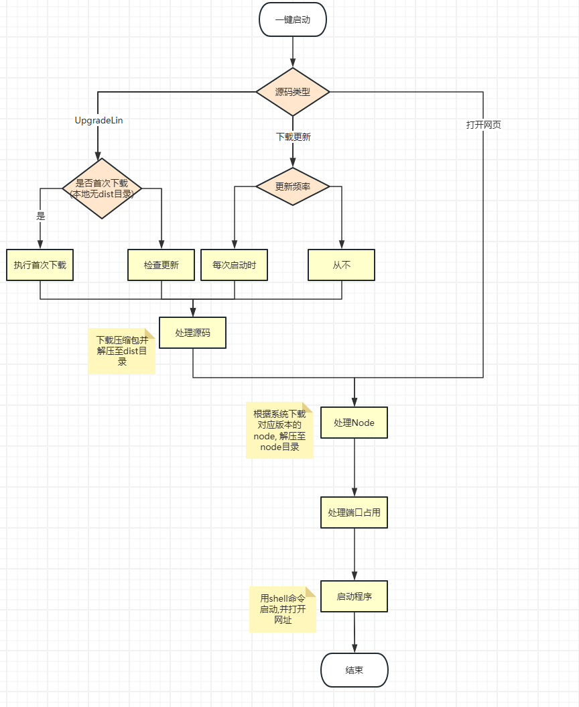
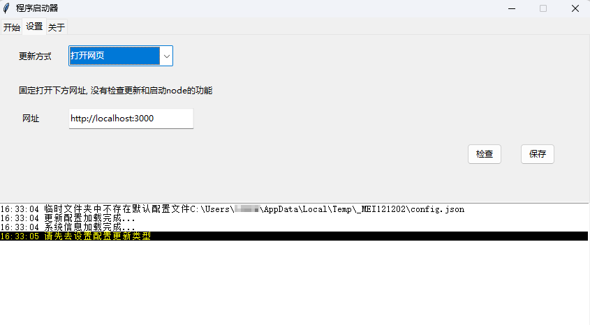
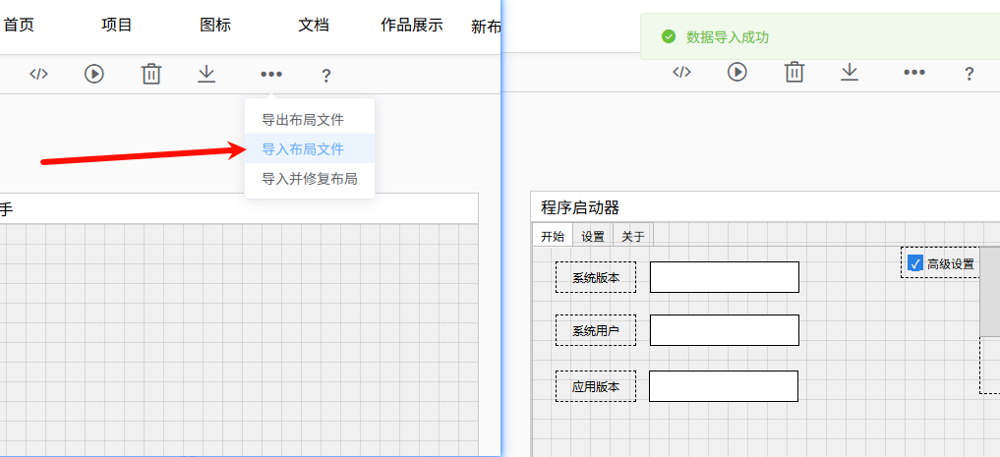
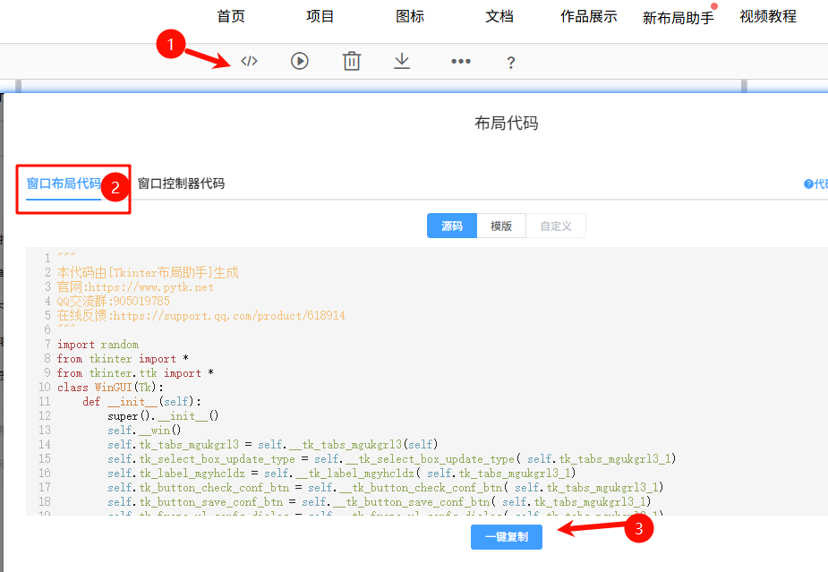

## 介绍

一个由python和tkinter开发的Node程序启动器. 支持自动检查更新, 自动下载node, 并启动node服务.适合Nuxt/Next等基于Node开发的程序.理论上支持所有Node项目的运行.
能解决客户电脑没有Node环境的使用问题. win10及以上版本建议用Tauri或Electron直接打包, 这个启动器是适配win7的.

## 运行原理

1. 处理dist
通过设置中配置的三种更新方式, 程序会自动选择合适的方式下载源文件.UpgradeLink支持自动检查更新.
control.py的_update_btn_handle方法中实现.
2. 处理node
根据系统架构, 自动选择合适的node版本下载.control.py的_handle_node_zip方法中实现.
系统对应的node版本在config.js里配置nodeVersion数组
3. 启动并打开网页
在file_utils.start_node_server方法实现. 先杀掉已存在的node进程(默认是3000端口), 再启动新的node进程. 程序的输出也会打印到主界面的日志框中.control中的read_process_output_thread实现的日志读取.

## 使用说明
普通用户可以下载release版本, 直接双击运行即可. 
由于没有默认配置, 所以第一次运行时会提示用户输入配置信息.

用户可以在设置中修改更新方式, 包括下载地址/更新地址等.
设置后点保存, 然后重启测试程序

## 开发/本地打包
本地开发的优势是可以打包默认配置文件. 打包后的exe可以直接交给客户使用, 无需客户手动创建配置文件.
1. 设置python环境
推荐开发环境**Python 3.7**, py3.7打包后可以在win7下运行
2. 安装依赖
3. 在项目根目录创建默认的config.json, 可根据config.demo.json做修改
4. 启动项目
python main.py
依赖正确的情况下就能展示主界面了
5. 更新ui
ui界面用的是[Tkinter布局助手](https://www.pytk.net/), 是一个[开源项目](https://github.com/iamxcd/tkinter-helper).
打开[Tkinter布局助手](https://www.pytk.net/), 把'程序启动器.tk'文件导入, 就可以直接在网页上做布局了.

添加控件后, 可以点击'窗口布局代码', 一键复制布局代码到ui.py中

> 注意:
布局器中的高级设置没有绑定variable,需要手动修改一下
> ```python
>     def __init__(self):
>         super().__init__()
>         self.__win()
>         self.admin_check_var = BooleanVar() #这是新增的
>         ...其他代码...
>     def __tk_check_button_admin_check(self,parent):
>         #variable=self.admin_check_va是新增的
>         cb = Checkbutton(parent,text="高级设置",variable=self.admin_check_var)
>         cb.place(x=374, y=0, width=80, height=30)
>        return cb
> ```
**该网站没有撤销/历史记录, 记得及时导出备份!!!**
**该网站没有撤销/历史记录, 记得及时导出备份!!!**
**该网站没有撤销/历史记录, 记得及时导出备份!!!**
6. 修改功能
布局器生成的'窗口控制器代码'不要复制, 自己根据事件在control.py里新建函数并实现即可
7. 打包
> --add-data "config.json;."是为了把配置文件打包进去, 解释请看运行原理
```python
# 打包个调试版本, 启动有黑窗口能看到print
pyinstaller --onefile main.py --name 文件名    --add-data "config.json;."
# 打包个正常版本, 启动无黑窗口
pyinstaller --onefile main.py --name 文件名 --noconsole    --add-data "config.json;."

```

## 程序优化
* 替换图标
* 添加授权key
* 加密存储[UpgradeLink](http://upgrade.toolsetlink.com/)的sk
> 说明: 为了防止客户直接修改升级地址, 所以在config.json中存储的是加密后的sk, 程序启动时会解密, 并设置给UpgradeLink. 客户如果要修改升级地址, 只能通过程序的设置界面修改, 程序会自动加密并保存.

加密方式在'ConfigManager.py'中有写, 可以参考


## 常见问题
* win7下启动报api-ms-win-core-path-l1-1-0.dll缺失
**解决办法**: 用python3.7的环境打包即可

* 手动修改config.json后, 重新启动项目后报错
**解决办法**: 目前只在win7下复现了错误, 建议不要手动修改.

* win7下chrome打开网页时丢失css样式
**解决办法**: 用360浏览器的极速模式打开正常. 


